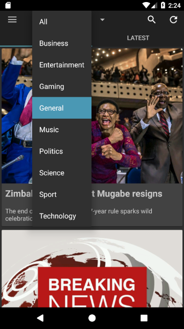
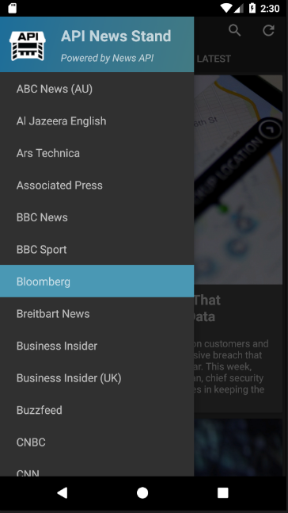
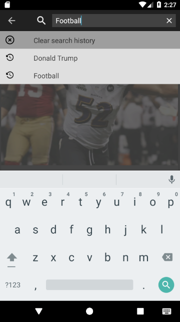
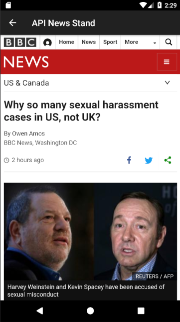

# API News Stand
A capstone project for the Udacity Android Developer Nanodegree. Users can browse the feeds obtained through various news sources whose data is aggregated by [News API](https://newsapi.org/). Attached below are screenshots that demonstrate the UI of the app.  

### MainActivity ###
  

### SearchActivity ###
 

### WebViewActivity ###
  
